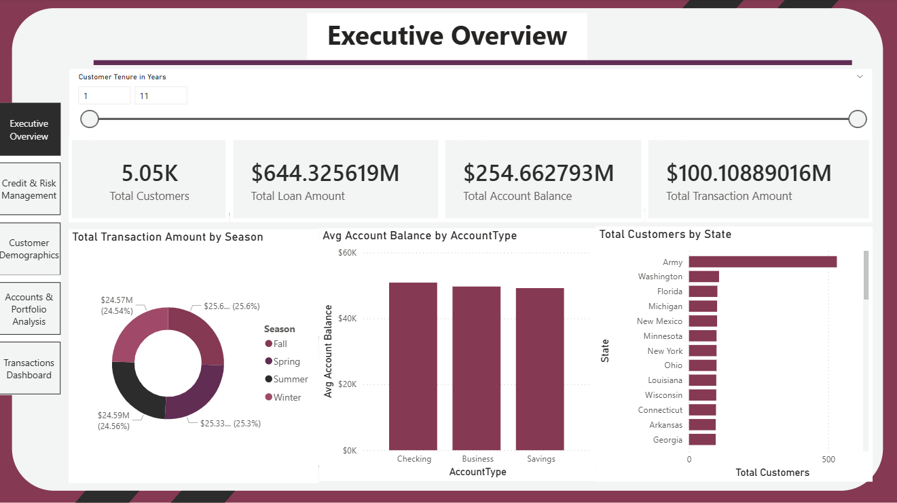
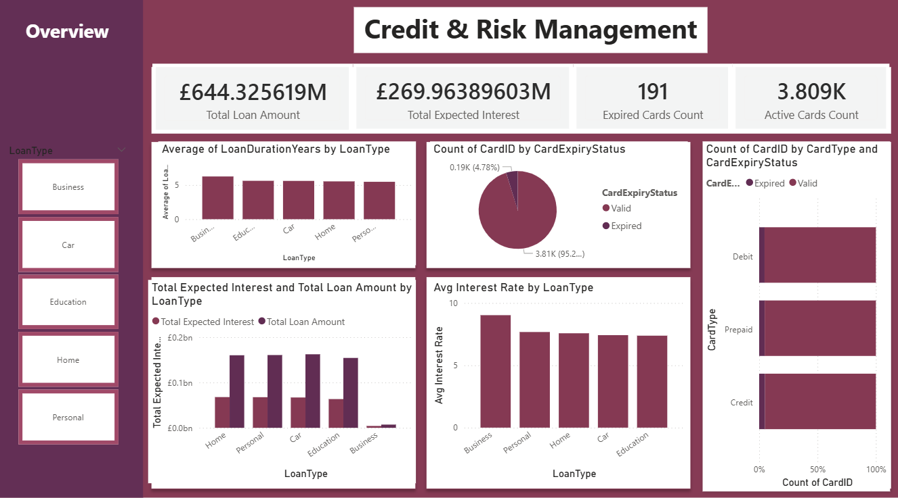
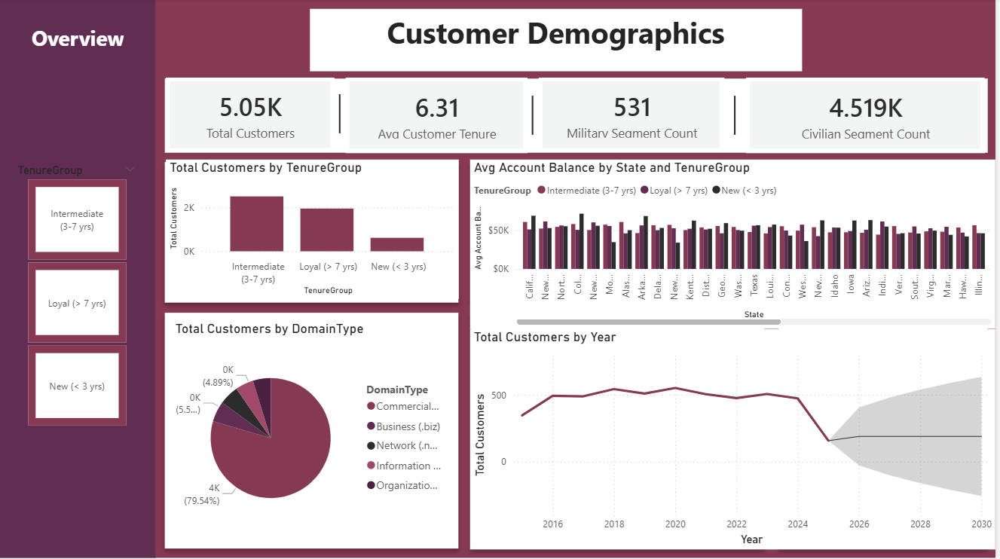
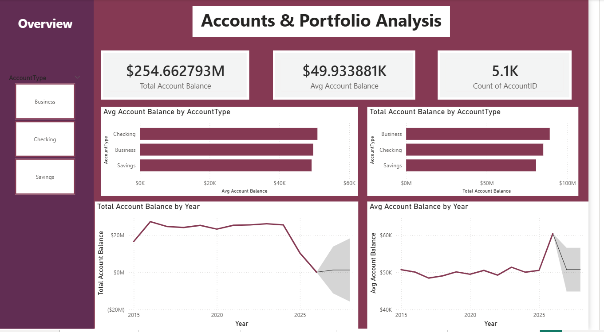
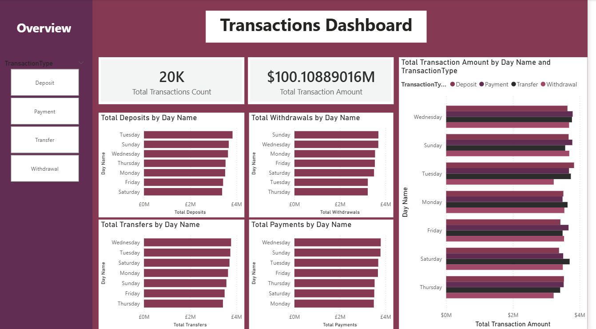

# 🏛️ Commercial Banking BI & Risk Management Dashboard

## 📌 Executive Summary
An enterprise-grade Banking Business Intelligence solution developed in **Power BI** to deliver holistic visibility into executive operations, loan risk profiles, customer demographic distributions, and daily transaction throughput across $100M+ in transaction volumes and $640M+ in loan portfolios.

---

## 📊 Dashboard Modules & Architecture

### 1. Executive Overview

* **Key Metrics:** Total Customers (5.05K), Total Loan Portfolio ($644.33M), Total Account Balance ($254.66M), and Total Transactions ($100.11M).
* **Strategic Highlights:** Seasonal revenue pacing, average balances by account tier (Checking vs. Business vs. Savings), and state-level customer penetration.

---

### 2. Credit & Risk Management

* **Risk KPIs:** Total Expected Interest ($269.96M), Active Card Ratio (95.2%), and Expired Card Tracking (191 cards).
* **Portfolio Health:** Loan duration evaluation, comparative expected interest across loan products (Personal, Home, Car, Education, Business), and interest margin monitoring.

---

### 3. Customer Demographics & Segment Behavior

* **Demographic Breakdown:** Customer tenure cohorts (Intermediate, Loyal, New), domain-level segmentation, and account balance analysis across geographic regions.
* **Segment Analysis:** Split between civilian and military customer accounts with tenure forecasting.

---

### 4. Accounts & Portfolio Performance

* **Account Distribution:** Average account liquidity ($49.93K), total balance allocation across business and personal deposit accounts, and historical account balance trend forecasting.

---

### 5. Transactions & Cash Flow Dashboard

* **Throughput Metrics:** 20,000 total transactions totaling $100.11M.
* **Flow Analysis:** Daily volume breakdowns across transaction mechanisms (Deposits, Withdrawals, Transfers, and Payments) to detect operational peaks.

---

## 🛠️ Tech Stack & DAX Methods
* **BI Platform:** Microsoft Power BI
* **Data Modeling:** Star Schema & Relationship Optimization
* **DAX Formulas:** Time Intelligence, Interest Projection, Portfolio Aggregations, Dynamic KPI Formatting
